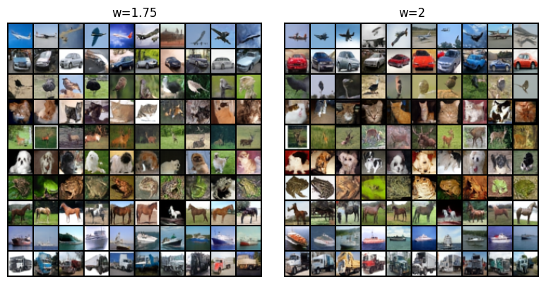

# Conditional Image Generation with VAE + DiT

A conditional image generation pipeline for CIFAR-10: a convolutional VAE learns a compact
latent space, and a latent Diffusion Transformer (DiT) is trained on top of it with a
flow-matching objective and classifier-free guidance (CFG).

Based on the lab from MIT's [*Introduction to Flow Matching and Diffusion Models*](https://diffusion.csail.mit.edu/2026/index.html) (2026).

The full pipeline lives in [dit-lab.ipynb](dit-lab.ipynb).

## Samples

Class-conditional samples generated with the trained DiT (guidance scales `w=1.75`, `w = 2.0`):



*(10 samples per class, sampled with 250 ODE steps.)*

## Results

FID computed against CIFAR-10 statistics, swept over classifier-free guidance scale
(DiT, epoch 1000, 250 sampling steps, 10k generated images per setting):

| Guidance scale `w` | FID ↓ |
|---:|---:|
| 1.25 | 18.35 |
| 1.50 | 16.78 |
| 1.75 | 15.43 |
| **2.00** | **14.91** |
| 2.25 | 15.00 |

Best result: **FID 14.91** at `w = 2.0`. FID degrades on both sides of this value —
too little guidance under-conditions the model, too much over-saturates samples and hurts
diversity, which is the usual CFG trade-off.

## Work in progress: larger DiT

The FID numbers above are from the current checkpoint (`dit_jul`, 14 layers, dim 512).
A larger DiT is currently training — deeper and wider transformer, more epochs, and a different LR schedule than the current run. This README and the results table above will be updated once it's done and evaluated.

| | Current (`dit_jul`) | New (training) |
|---|---|---|
| Layers | 14 | 16 |
| Dim | 512 | 394 |
| Epochs | 1000 | 2000 |
| LR schedule | constant `1e-4` after warmup | cosine |
| Status | done, FID 14.91 @ `w=2.0` | in progress |

## Project structure

- [models/](models/) — VAE and DiT model definitions
- [trainers/](trainers/) — training and checkpointing logic
- [flow/](flow/) — probability paths and ODE/sampling utilities
- [utils/](utils/) — latent statistics, interpolation, and FID helpers
- [results/](results/) — generated sample outputs

## Model details

| | |
|---|---|
| VAE | conv encoder/decoder, hidden channels `[8, 16, 16]`, β = 0.01, trained 100 epochs |
| Latent shape | `16 × 8 × 8` |
| DiT | 14 layers, dim 512, 8 heads, patch size 1, 11 classes (10 + null token for CFG) |
| DiT training | 1000 epochs, lr 1e-4, 10k warmup steps, EMA decay 0.9999, null ratio 0.1 |
| DiT checkpoint size | ~257 MB |

## Pretrained weights

Checkpoints (`vae_jul`, `dit_jul`) are too large for the git repo itself, so they're hosted
separately on the [Hugging Face Hub](https://huggingface.co/<your-username>/<your-repo>).

Download them with:

```bash
pip install huggingface_hub

python -c "
from huggingface_hub import snapshot_download
snapshot_download(repo_id='kahniel/dit-cifar10', local_dir='runs')
"
```

This should populate `runs/vae_jul/` and `runs/dit_jul/` with the checkpoints the notebook
expects (`trainer.load(..., ckpt_dir='runs/vae_jul')` / `runs/dit_jul`).

**Fallback (no Hugging Face account):** checkpoints are also attached as binary assets on the
[GitHub Releases page](../../releases) — download the `.zip` from the latest release and unzip
into `runs/`.

## Quick start

1. Install dependencies:
   ```bash
   pip install -r requirements.txt
   ```

2. Download pretrained weights (see above), or train from scratch by uncommenting the
   `trainer.train(...)` cells in the notebook.

3. Open [dit-lab.ipynb](dit-lab.ipynb) and run the cells in order. The notebook will:
   - download CIFAR-10
   - train (or load) the VAE
   - compute latent statistics
   - train (or load) the latent DiT
   - generate samples and evaluate FID across guidance scales